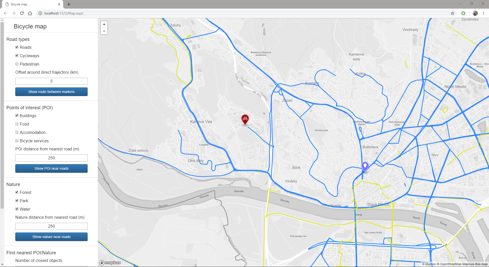
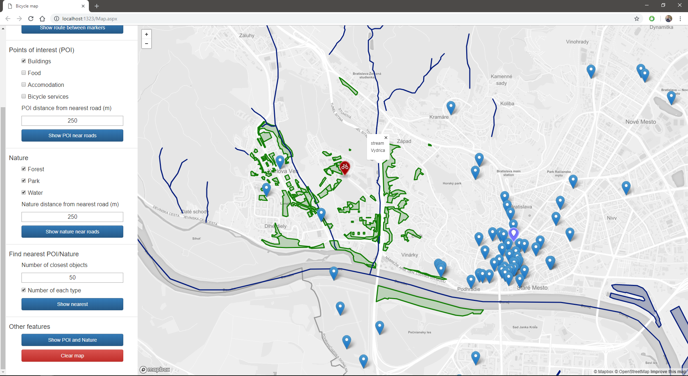
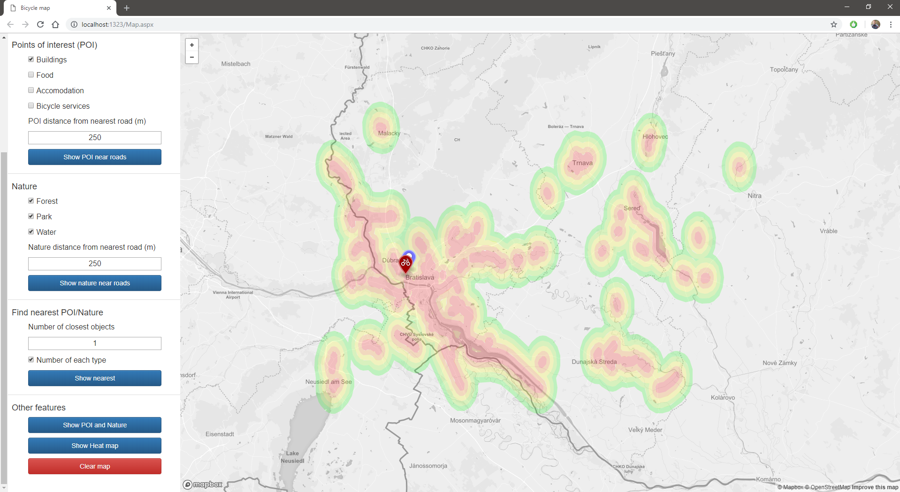

# Overview

This application shows roads usable for road bicycles (that means roads of either first, second or third class, cycleways) and footwalks where you can pass with a bicycle. It also allows you to search for points of interest (POI) and natural landscape in close proximity around roads. So you can use this application to:

- Show roads of selected types (roads [first, second and third class, excluding highways and tunnels], cycleways and footwalks) in set distance around line connecting two markers on the map
- Show POI of selected types (buildings [castles, cathedrals, churches, bunkers, city gates], food [pubs, bars, restaurations], accomodation [hotels, hostels, motels] and bicycle services [bicycle parking, bicycle rental, bicycle service] in set distance near filtered roads
- Show natural landscape of selected types (forest, park, water [streams, rivers, lakes, riverbanks]) in set distance near filtered roads
- Show N nearest objects (or N of each type) of selected types to bicycle marker on the map
Other features:
- Show both POI and Nature at the same time
- Show heatmap of cycleways
- Clear map of existing items

Roads around selected route:

SELECT ST_AsGeoJSON(geom) as geom, type from roads where

(type = 'primary' OR

type = 'secondary' OR

type = 'tertiary' OR

type = 'road' OR)

type = 'cycleway' AND

ST_DWithin(geom, ST_MakeLine('lonStart', 'latStart', lonEnd', latEnd'), 2000, true)

Show nearest object around filtered roads:

// roads then nearby objects

SELECT DISTINCT ST_AsGeoJson(ST_Centroid(b.geom)) as bgeom, b.type from

(SELECT ST_AsGeoJSON(geom) as geom, type from roads where

type = 'cycleway' AND

ST_DWithin(geom, ST_MakeLine('lonStart', 'latStart', lonEnd', latEnd'), 2000, true)) as r

JOIN

((SELECT type, geom, name from nature where

(type = 'forest' OR

type = 'park')

UNION

(SELECT type, geom, name from waterways where

type = 'river' OR

type = 'riverbank' OR

type = 'stream')) as b

on ST_DWithin(b.geom, r.geom, 250, true)

// select roads again to show them on the map

UNION

select * from r

Nearest N objects of selected types:

Heatmap

The application has 2 separate parts, the client which is a [frontend web application](#frontend) using mapbox API and mapbox.js and the [backend application](#backend) written in [ASP.NET](https://www.asp.net/), with data provided by PostGIS extension of Postgres. The frontend application communicates with backend using a [REST API](#api).

# Frontend

The frontend application is a static ASP page (`Map.aspx`), which shows a mapbox.js widget. It is displaying roads, buildings and natural landscape. Colors used for this objects are selected to be intuitive (dark green for forests, dark blue for water covered areas), and since most of this colors are dark, map style is mapbox.light for better contrast. This map already contains all roads and streets drawn with white color, so application is not drawing whole road net, only selected types to highlight them.

All map functions are handled by mapbox api by handling geojson representing what application needs to show. This geojson is provided by backend. Only frontent functionality is moving markers around the map and gathering input trough the form on the left side. Form is separated to logic subparts by highliting groups of elemenents required for each type of query. For form styles is used [Bootstrap](https://getbootstrap.com/).

# Backend

The backend application is written in C# and is responsible for querying geo data, formatting the geojson and data for the sidebar panel.

## Data

Roads, buildings and nature data is comming from rectangular area covering aproximately Bratislava district from Open Street Maps. Compressed, this was more than 1.2GB and the webpage does not allow to download more. Standard tool for importing osm data to Postres, 'osm2pgsl' is not up to date for Windows. Some functions have changed names inn newest version of Postgis, so this tool is trying to use non existing functions. For this reason, I used QGis, opensource application for drawing GIS maps. This application allows importing of osm data and saving them as Shapefile, which can be imported to Postgres with Postgis plugin.

All data tables contain same columns: 
  - gid: used by Postgis as id
  - osm_id: another id
  - name: name of object represented by geometry
  - type: type of object represented by geometry
  - geom: Postgis geometry

My application is quering name, type and geom. Name is only used for display purposes. Filtering is performed on type and geom, so I created index on type for each table. Geom cannot be indexed, because it is too large.

Tables used by applications:
  - buildings
  - landuse
  - nature
  - points
  - roads
  - waterways
  
A lot of querying is done based on type, and application uses small portion of types. For this reason, I tried view and later materialized view from types which are used by application. Neither option increased performance, because indexing already did it's job. Some queries are using geometry transformed by some PostGis function, but again, index coul not be created because geometries are too large to be indexed.

Data for heatmap are stored in two materialized views. Materialized view stores result of a query and is updated only on update call. After the modification of road data this view needs to be recalculated. One view stores multiline geometry, where all cycleways are connected to one. Second view stores polygons representing areas in 5 different distance ranges from the road. Each range is collored by different color on the map.

## Api

**This POST queries data needed for roads**

`type: POST,
async: true,
processedData: true,
cache: false,
url: 'Map.aspx/ShowRoads'
data: '{lat 48, lon 18, radius 2000, cycleway true, footway true, other false}'
contentType: 'application/json; charset=utf-8',
dataType: 'json'`

### Response

API returns formated geojson, which is then added to map layer and mapbox api shows objects represented by this geojson.
